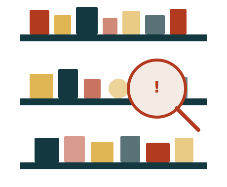

# FindIt

> *You don't lose things. You misplace them.*

A small, opinionated Django CRUD app for the stuff in your home you can never find when you actually need it. Snap a photo, drop it on a shelf, log it once — future-you says thanks.



## What it does

FindIt is a personal organizer for physical things. You log an item, put it somewhere, and get one job done well: finding it again later.

- **Things** — items you own (with optional photos, tags, and quantity)
- **Locations** — rooms, shelves, drawers, boxes; nest as deeply as your house actually does
- **Move history** — every time something moves, a log entry records when and where
- **Tags** — a shared catalog (fragile, electronics, seasonal, valuable) for cross-cutting filtering
- **"Found it?" feedback loop** — every lookup asks if the location was right, so the data heals itself
- **Lend without losing** — mark a person as a location, set a return date, see what's overdue
- **Soft archive** — "I don't have this anymore" instead of permanent delete

## What's notable

- **Hierarchical locations** — a closet inside a bedroom inside a house; reparent by drag-and-drop on the home page.
- **AI bulk add** — dictate or paste a freeform description ("I have fishing gear and a propane tank on my boat Indigo in the Starboard Cockpit Locker") and the app extracts each item, picks the right location path, and even suggests location icons.
- **Auto-fetched product photos** — when you add an item without uploading a photo, FindIt fetches a representative image from Google Images via Serper.dev.
- **Lend tracking with overdue detection** — mark a person as a location, set a return date, see overdue items in red on the home page.
- **Move history per item** — every move is logged with an optional note and return date.
- **Org-chart visualization** — your collection rendered as a flowchart on the home page, with drag-and-drop to reparent locations and move items between them.

## Built with

- **Python 3.12** + **Django 6.0**
- **PostgreSQL** (with SQLite fallback for first-run dev)
- **django-environ** + **python-dotenv** for env var management
- **Pillow** for image upload + resizing
- **WhiteNoise** for static file serving in production
- **gunicorn** as the production WSGI server
- **dj-database-url** for Heroku Postgres connection parsing
- **OpenAI Whisper + GPT-4o-mini** for voice/text bulk item intake
- **Serper.dev** for Google Images product photo fallback
- **Lucide** for line-icon SVGs on locations
- **HTMX** for the live map panel
- **SortableJS** for drag-and-drop move operations on the map
- Plain Django templates, vanilla CSS (Grid + Flexbox), Inter + Fraunces from Google Fonts
- Hand-rolled SVG illustrations

## Getting started

### 1. Clone & install

```bash
git clone <your-repo-url>
cd findit
pipenv install        # or: python -m venv .venv && source .venv/bin/activate && pip install -r requirements.txt
```

### 2. Configure environment

```bash
cp .env.example .env
# edit .env and set SECRET_KEY, DB_USER, DB_PASSWORD, DB_NAME
```

If you leave `DB_USER` blank, FindIt will fall back to a local SQLite file so you can poke around immediately. **For grading and deployment, use PostgreSQL** (the rubric requires it).

### 3. Set up the database

Create the database (PostgreSQL):

```bash
createdb findit
```

Then migrate:

```bash
pipenv run python manage.py migrate
pipenv run python manage.py createsuperuser    # optional, for /admin
```

### 4. Run

```bash
pipenv run python manage.py runserver
```

Visit [http://localhost:8000](http://localhost:8000), sign up, and start putting things away.

## Live demo

🔗 **Deployed app:** [find-it-app on Heroku](https://find-it-app-889e9b2290ea.herokuapp.com/)

🔗 **Planning materials:** _Add link to your wireframes / ERD / Trello board_

## Project layout

```
findit/
├── manage.py
├── Pipfile
├── findit/                 # project config
│   ├── settings.py
│   ├── urls.py
│   └── wsgi.py
└── main_app/               # the actual app
    ├── models.py           # Item, Location, Tag, LocationLog
    ├── views.py            # function + class-based views
    ├── forms.py
    ├── urls.py
    ├── admin.py
    ├── static/
    │   ├── css/base.css
    │   └── images/         # SVG illustrations
    └── templates/
        ├── base.html
        ├── home.html
        ├── about.html
        ├── items/          # index, detail
        ├── main_app/       # form & confirm_delete templates (Django CBV convention)
        └── registration/   # login, signup
```

## Data model

```
User ─┬── Item ─┬── LocationLog
      │        └── Tag (M2M, shared catalog)
      └── Location ── Location (parent self-ref)
```

- One `User` owns many `Item`s and many `Location`s.
- Each `Item` has zero-or-one current `Location`, many historical `LocationLog`s, and many `Tag`s.
- `Location.parent` points to another `Location` (so a safe can live inside a closet inside a bedroom).

## Authorization model

- All item, location, and tag CRUD requires login.
- Items are scoped per-user: you can only see, edit, or delete your own.
- Tags are a shared catalog (any logged-in user can read all tags and add new ones).
- Guests can see the marketing home page, the About page, and the auth screens.

## Attributions

- **Inter** typeface by Rasmus Andersson — [Google Fonts](https://fonts.google.com/specimen/Inter)
- **Fraunces** typeface by Phaedra Charles, Lasse Fister & Travis Kochel — [Google Fonts](https://fonts.google.com/specimen/Fraunces)
- **Lucide** icon set by the Lucide contributors — [lucide.dev](https://lucide.dev) (ISC license; SVGs vendored under `main_app/static/icons/`)
- **OpenAI** Whisper + GPT-4o-mini APIs — used for voice transcription and natural-language item extraction in the bulk-add flow
- **Serper.dev** — Google Images search API used for the product-photo fallback when no photo is uploaded
- **HTMX** ([htmx.org](https://htmx.org)) and **SortableJS** ([sortablejs.github.io](https://sortablejs.github.io/Sortable/)) — used for live interactions on the map page
- All illustrations are hand-authored SVG (no third-party clip art).

## Next steps (stretch goals)

- 🔍 **Postgres trigram search** — typo-tolerant search via `pg_trgm` so "umbrela" still finds umbrellas.
- 📸 **Photo dump intake** — bulk upload many photos at once and label them in a queue (great for moving in).
- 👥 **Household sharing** — opt-in shared view so a partner can find the holiday decorations too.
- 🔔 **Lent-out reminders** — passive email digest for items past their return date.
- 📦 **Quantity per location** — split a single item across multiple locations ("4 in garage, 2 in attic").
- 🎨 **Color/shape descriptor tags** — separate from category tags, for "the small blue one with a cracked corner."

## License

Personal project for General Assembly Unit 4. Code may be reused freely.
